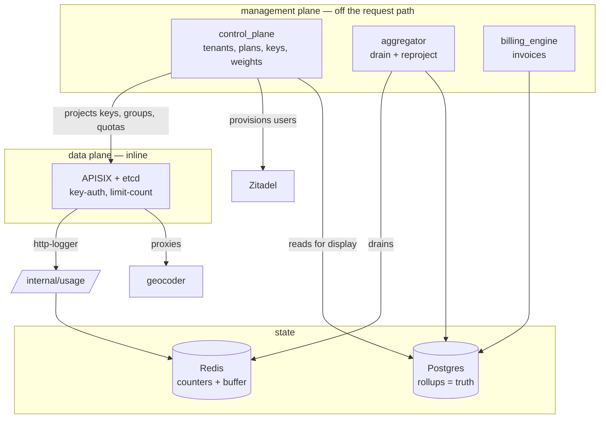
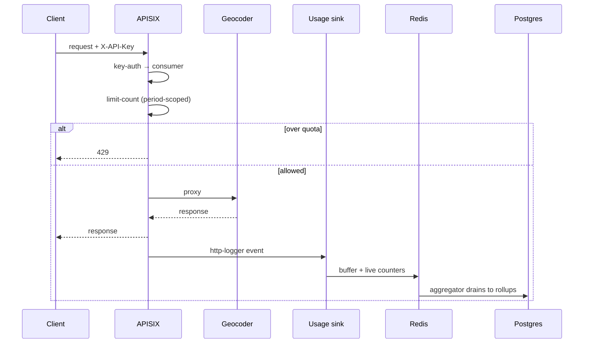

# Architecture Spine — billing / control plane

## Design Paradigm

**Two-plane control/data separation.**

The **management plane** (`billing/control_plane.py`, FastAPI) owns state:
tenants, plans, keys, weights, invoices. It does not sit in the request path.
It *projects* that state outward — into APISIX through the Admin API, and into
Zitadel for identity — and hosts the usage sink that receives what the data
plane reports.

The **data plane** (Apache APISIX + etcd) enforces inline: it authenticates the
API key, applies the tenant's quota, and ships a usage event per request. It
never queries the management plane on the hot path.

The consequence worth internalizing: a control-plane outage stops
administration, not traffic.

## Invariants & Rules

### AD-1 — The management plane is never in the request path [ADOPTED]

- **Binds:** `control_plane`, APISIX route config
- **Prevents:** a management dependency that turns an admin outage into a
  customer-facing outage, and a per-request round trip that caps throughput
- **Rule:** Enforcement decisions are made by the data plane from state already
  projected into it. The control plane projects state and receives usage; it is
  never called synchronously to authorize a request.

### AD-2 — Postgres rollups are the source of truth for usage [ADOPTED]

- **Binds:** metering, invoicing, tenant usage display
- **Prevents:** billing or displaying numbers that silently reset — the shared
  Redis is non-persistent and LRU-evicting, and this exact failure already
  forced the usage display off Redis
- **Rule:** Redis is a counting and buffering tier only. Anything a tenant is
  billed for, or shown as consumption, is read from the Postgres rollups. A
  Redis flush may cost quota accuracy within the current period; it may never
  lose billable history.

### AD-3 — Quota is enforced cluster-wide and period-scoped

- **Binds:** APISIX consumer-groups, the aggregator
- **Prevents:** per-replica quotas that let N gateway replicas serve N times the
  purchased allowance, and a quota window that drifts out of step with the
  invoice period
- **Rule:** Hard quotas are enforced by `limit-count(redis)` on a per-tenant
  consumer-group, with the Redis key scoped to the calendar period
  (`<group>:<YYYY-MM>`) so it resets in step with the rollups. The aggregator
  re-projects each tenant's group on month rollover.

### AD-4 — A rejected request never bills

- **Binds:** `usage.incr_tenant_if_allowed`, `usage.allow_rps`
- **Prevents:** charging for requests that were refused, and the reverse — a
  non-atomic check-then-increment letting concurrent requests both pass a
  boundary
- **Rule:** Rate-limit rejection happens before the quota increment, and the
  quota increment is an atomic conditional: a request that would exceed the
  allowance is refused without consuming any of it. Independently, the usage
  sink counts only *served* requests — an event with status >= 400 or no
  consumer is discarded, never rolled up. Both guards must hold; neither alone
  is sufficient, because they cover different failure paths.

### AD-5 — Key material is stored twice, plaintext never [ADOPTED]

- **Binds:** `security`, `repo`, the keys API
- **Prevents:** either a database leak yielding usable keys, or a design that
  cannot show a tenant the key it already owns
- **Rule:** Persist the sha256 hash for lookup and a Fernet-encrypted `key_enc`
  for tenant reveal. Never persist plaintext. The hash alone must remain
  insufficient to reconstruct a key.

### AD-6 — Deletion is soft, everywhere

- **Binds:** tenants, API keys, users
- **Prevents:** destroying the audit trail behind an invoice that has already
  been issued
- **Rule:** Deletion sets `status='deleted'` and retains the row. Tenant
  deletion cascades to that tenant's keys in one transaction. Queries exclude
  deleted rows by default rather than relying on callers to filter.

### AD-7 — Credits are integer milli-credits end to end

- **Binds:** `weights`, the usage sink, the billing engine
- **Prevents:** floating-point drift accumulating across millions of counter
  increments into invoices that do not reconcile
- **Rule:** 1 credit = 1000 milli-credits, integral at every stage. Endpoint
  attribution is the **first path segment**, so `deep/forward` and `deep/nearby`
  both bill as `deep`. An endpoint with no weight row costs 1 credit.

### AD-8 — One Identity shape, two interchangeable verifiers [ADOPTED]

- **Binds:** `auth`, `control_plane`, `gateway`
- **Prevents:** authentication mode leaking into business logic, which would
  make the IdP unswappable
- **Rule:** `BILLING_AUTH_MODE` selects the verifier — `dev` (local HS256 issuer
  over the `users` table) or `zitadel` (OIDC RS256 against the Zitadel JWKS).
  Both map to the same `Identity` (role, tenant_id). No code outside `auth` may
  branch on the auth mode.

### AD-9 — Invoicing is idempotent per (tenant, period)

- **Binds:** `billing_engine`
- **Prevents:** a retried or re-run billing job double-charging a tenant
- **Rule:** Generating an invoice for a (tenant, period) that already has one
  updates it rather than issuing a second. Re-running a closed period must be
  safe.

### AD-10 — Free endpoints are free at the route, not in code

- **Binds:** APISIX route config, `usage.is_free_path`
- **Prevents:** health checks and capability discovery consuming quota or
  polluting usage events — and the divergence of two different free-lists
- **Rule:** Free endpoints are excluded at the route level from both
  `limit-count` and `http-logger`, driven by one list in config. A path is free
  in both places or neither.

### AD-11 — The quota period key is projected, never computed at request time

- **Binds:** `apisix_admin.ensure_consumer_group`, the aggregator's rollover
- **Prevents:** the data plane deriving a period from its own container clock,
  which would drift from the UTC rollups and split a billing month in two
- **Rule:** The control plane computes `<group>:<YYYY-MM>` in UTC and projects it
  into APISIX as a literal. The data plane never computes it. The consequence is
  an operational coupling that must be honored: if the aggregator does not
  re-project on the 1st, tenants keep spending the previous month's bucket.

### AD-12 — Two path rules, each with one job

- **Binds:** `weights`, `usage.is_free_path`, the usage sink
- **Prevents:** a new component applying one path rule to the other's job, which
  would either bill free endpoints or mis-weight paid ones
- **Rule:** Billing weight is keyed on the **first path segment**, so
  `deep/forward` and `deep/nearby` share the `deep` weight. Free-endpoint
  matching is on the **full normalized path**, so `/traffic/probes` is free while
  `/traffic/edge` bills. These are deliberately different; do not unify them.

### AD-13 — The billing domain stays independently deployable

- **Binds:** `billing/`
- **Prevents:** a shared-library coupling that forces the geocoder and the
  billing plane to release together
- **Rule:** `billing/` imports nothing from `services/` or `shared/`. Where that
  costs duplication — the Redis client, isolated by `config.REDIS_PREFIX` — the
  duplication is deliberate and documented at the copy site.

### Plane separation



## Consistency Conventions

| Concern | Convention |
| --- | --- |
| Money & credits | Integer milli-credits (AD-7); never floats |
| Period | Calendar month as `YYYY-MM`, one representation across quotas, rollups, invoices |
| Endpoint key | First path segment of the request path |
| Identity | `Identity(role, tenant_id)` regardless of auth mode (AD-8) |
| Deletion | `status='deleted'`, never a hard `DELETE` (AD-6) |
| Redis keys | Prefixed by `config.REDIS_PREFIX` so the shared instance stays isolated |
| Roles | Two only: admin and tenant; guards live in `auth`, not in handlers |
| Internal module direction | `config` ← `security` ← `repo` ← engines/handlers; `main` wires |

## Stack

| Name | Version |
| --- | --- |
| Apache APISIX | 3.9.1-debian |
| etcd | v3.5.16 |
| Postgres | 16-alpine |
| Zitadel | unpinned (`:latest`) |
| FastAPI / asyncpg | >=0.110,<1.0 / >=0.29,<1.0 |
| cryptography (Fernet) | per `billing/requirements.txt` |
| Console | React + Vite |

## Structural Seed

### Request lifecycle



### Source layout

```text
billing/
  control_plane.py   # management API: admin + tenant surfaces
  apisix_admin.py    # projects routes, consumer-groups, consumers
  zitadel_admin.py   # provisions identity
  usage.py           # counters, buffer, free-path rules
  aggregator.py      # drains Redis → Postgres rollups
  billing_engine.py  # invoices from rollups x plan pricing
  weights.py         # per-endpoint credit weights
  repo.py / db.py    # data access, schema, seed
  auth.py / security.py
  gateway.py         # reference implementation; NOT deployed
  frontend/          # React console
```

## Deferred

- **Retiring or relabelling `gateway.py`.** It is a complete, tested
  implementation of the data plane that nothing deploys. Keeping it as an
  APISIX-independent reference is defensible; leaving its docstring claiming it
  *is* the data plane is not. Disposition is a decision, not an invariant.
- **The `BILLING_AUTH_MODE` default split.** Code defaults to `dev`, compose to
  `zitadel`. Whether the code default should change is a security call for the
  gap register.
- **Pinning Zitadel.** Currently `:latest`, against an identity provider — the
  highest-consequence unpinned image in the stack.
- **Multi-region / multi-tenant data isolation.** Every tenant shares one
  Postgres schema. Whether that stays true at scale is undecided.
- **Quota accuracy under Redis loss.** AD-2 accepts that a flush costs
  within-period quota accuracy. Whether that needs a recovery path is unresolved.
