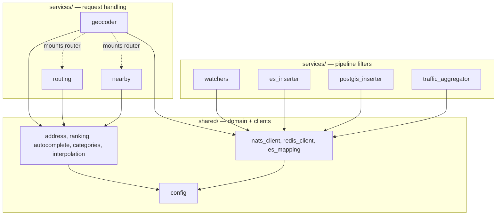
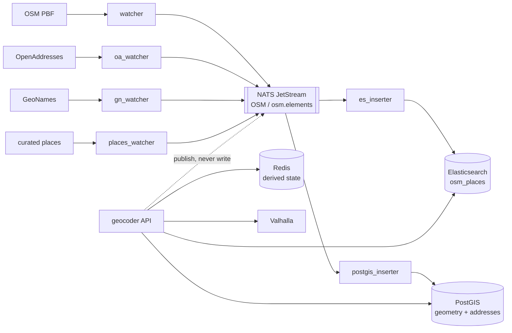
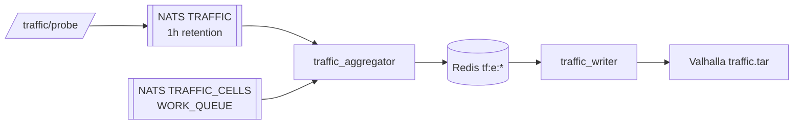
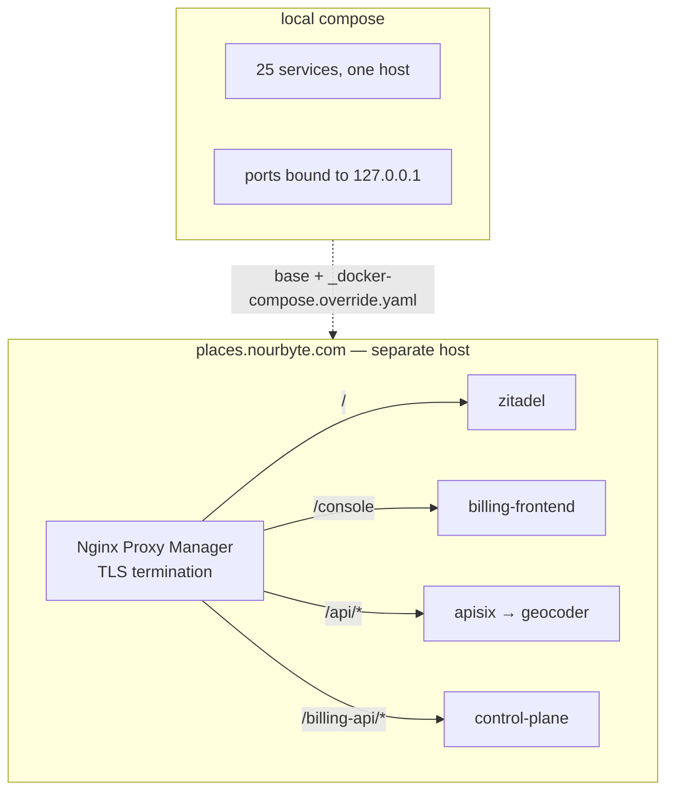

# Architecture Spine — geocoder platform

## Design Paradigm

**Pipes-and-filters for ingest, layered for serving.**

Ingest is a one-way pipeline: sources are parsed into a normalized element
message, published to NATS JetStream, and consumed by independent inserters that
each own one store. Filters never call each other; the stream is the only
coupling between them.

Serving is a layered FastAPI app: `services/` holds request handling and
orchestration, `shared/` holds domain logic and store clients. The layers map to
directories — `services/` may depend on `shared/`, never the reverse.

## Invariants & Rules

### AD-1 — The stream is the only durable write path [ADOPTED]

- **Binds:** all ingest and all write endpoints
- **Prevents:** a second write path that skips normalization, enrichment, dedup
  and the processed ledger, leaving ES and PostGIS holding different truths
- **Rule:** Durable document writes reach Elasticsearch and PostGIS only by
  publishing to the NATS OSM stream. `/insert` and `/places` publish; they do
  not write. `es_inserter` is the sole ES document writer, `postgis_inserter`
  the sole geometry writer.

### AD-2 — Exactly two audited direct-update exceptions [ADOPTED]

- **Binds:** `services/geocoder.py`
- **Prevents:** AD-1 eroding one convenient `es.update` at a time
- **Rule:** Two direct `es.update` calls are permitted, both partial field
  updates on documents that already exist, never creation: `popularity` from
  `/feedback`, and `ai_description` from `/describe`. Any new direct store write
  is a violation — publish instead.

### AD-3 — Exclusive store ownership

- **Binds:** all components
- **Prevents:** two owners of one fact, and reconciliation logic nobody planned
- **Rule:** Elasticsearch `osm_places` owns searchable documents. PostGIS owns
  geometry, address points, and the `processed_files` ledger. Valhalla owns
  routing tiles. Each fact has exactly one owning store; a reader of another
  store's fact goes through that store, never a second copy.

### AD-4 — Redis holds only rebuildable derived state

- **Binds:** `ac:*`, `tf:*`, and all cache keys
- **Prevents:** treating an LRU, non-persistent cache as a system of record —
  the failure the billing domain already hit and had to move to Postgres rollups
- **Rule:** Everything in Redis must be reconstructible from Elasticsearch,
  PostGIS, or a provider call. Losing Redis entirely may cost latency and warm-up
  time; it may never lose data. Each derived namespace has one owning module
  (AD-11, AD-12) — "rebuildable" does not mean "writable from anywhere".

### AD-5 — Every component is replica-safe [ADOPTED]

- **Binds:** all
- **Prevents:** a singleton that silently caps throughput and blocks horizontal
  scaling
- **Rule:** No in-process singletons, no leader election, no per-instance local
  state on the serving path. Use the mechanisms already here: shared durable NATS
  consumers, a `WORK_QUEUE` stream for exactly-once cell delivery, the leaderless
  Redis `SET NX` scheduler, `TRAFFIC_WRITER_SHARDS` per-tile sharding, and
  `PROCESSED_LEDGER=pg` atomic claims for multi-replica watchers.

### AD-6 — One-way layering [ADOPTED]

- **Binds:** `services/`, `shared/`
- **Prevents:** an import cycle that makes either layer untestable alone
- **Rule:** `services/` may import `shared/`. `shared/` must never import
  `services/`. Neither may import `billing/`. Cross-service imports are allowed
  only for the extracted units (`cache_service`, `enrichment`, `geocoder_helpers`,
  `geocoder_models`, `routing`, `nearby`).

### AD-7 — Configuration is read in exactly one module

- **Binds:** all of `services/` and `shared/`
- **Prevents:** the same variable read twice with different defaults — already
  observed, with `OLLAMA_URL` drifting between `shared/llm.py` and `shared/config.py`
- **Rule:** Every tunable is read in `shared/config.py` via `_safe_int` /
  `_safe_bool` / `_safe_float` and imported from there. Setting a third-party
  library's environment variable is not a tunable read and is exempt.

### AD-8 — Logging is lazy and centrally configured

- **Binds:** `services/`, `shared/`
- **Prevents:** formatting cost paid at disabled levels, and diagnostics that
  vanish because they went to stdout instead of the logger tree
- **Rule:** Obtain loggers from `shared.logging.get_logger`; pass `%s` args
  rather than f-strings; never `print()`. Mechanically enforced by ruff `G004`
  and `T20`.

### AD-9 — Search quality is gated by a frozen baseline

- **Binds:** search, ranking, autocomplete, categories, ES mapping
- **Prevents:** a green unit suite certifying a change that quietly destroys
  recall — the unit tests cannot see search quality at all
- **Rule:** Measure against `docs/quality-baseline.md` before and after. @5 and
  @10 recall may not drop; strict@1 may drop at most 1pp and only with a written
  explanation. Prefix-length monotonicity must hold.

### AD-10 — File ingestion is claim-based and idempotent

- **Binds:** `oa_watcher`, `gn_watcher`, `places_watcher`, `watcher`
- **Prevents:** the same source file imported twice by two replicas, doubling
  documents
- **Rule:** A watcher claims a file through the processed ledger before parsing
  it. Re-running a watcher is always safe; an unfinished claim is reclaimable
  after `PROCESSED_CLAIM_TTL`.

### AD-11 — The autocomplete index has one writing module

- **Binds:** every `ac:*` key
- **Prevents:** three existing callers — warm-from-ES, `/feedback` scoring, and
  `/places` indexing — drifting into three different entry encodings, which would
  corrupt ranking rather than fail loudly
- **Rule:** All `ac:*` writes go through `shared/autocomplete.py`
  (`index_entry`, `update_score`, `warm_from_es`). No component issues `zadd` or
  `hset` against those keys directly.

### AD-12 — The traffic edge schema is a cross-component contract

- **Binds:** `traffic_aggregator`, `routing` on-demand fetch, `traffic_writer`
- **Prevents:** three components that write and read the same keys choosing
  different units or timestamp formats — a silent corruption that surfaces as
  wrong routing speeds, not an error
- **Rule:** `tf:e:<graphid>` is a hash of `{kph, n, ts}` — speed in km/h as a
  2-decimal string, `n` the sample count, `ts` epoch seconds; `tf:idx` is a zset
  of `member=graphid, score=last_update_epoch`. Both probe aggregation and the
  provider fetch path write this exact shape. Read-modify-write folds run
  server-side and atomically (the aggregator's Lua EWMA); a client-side
  `hgetall` → compute → `hset` races and loses updates on hot edges.

### Dependency direction



## Consistency Conventions

| Concern | Convention |
| --- | --- |
| Element identity | `osm_id` as `n123` / `w456` / `r789`; the type prefix is part of the id |
| Message shape | The watcher element message is the pipeline contract: `osm_id`, `osm_type`, `tags`, `geom` (GeoJSON), `admin_level`, `area_km2` |
| Redis keys | Namespaced by purpose: `ac:` autocomplete, `ac:g:` geo-bucketed, `tf:e:` traffic edge, `tf:nd:` no-data marker, `tfc:sched:` scheduler |
| Config | Read once in `shared/config.py`, defaults inline, `_safe_*` parsers (AD-7) |
| Logging | `shared.logging.get_logger("<service>")` → the `geocoder.<name>` tree; lazy `%s` (AD-8) |
| Async | Async on the serving path throughout; `asyncio_mode = "auto"`, so async tests need no marker |
| Tests | Infra-dependent tests carry `@pytest.mark.integration` and are deselected by default |
| Service entry | `python -u -m services.<name>`; `run.py` is a dev convenience only |

## Stack

| Name | Version |
| --- | --- |
| Python | 3.11-slim |
| FastAPI | >=0.110,<1.0 |
| Pydantic | 2.x |
| uvicorn[standard] | >=0.27,<1.0 |
| Elasticsearch (server / client) | 8.11.0 / 8.x async |
| PostGIS | 16-3.4-alpine |
| NATS | 2.10 (JetStream) |
| Redis | 7-alpine |
| asyncpg | >=0.29,<1.0 |
| nats-py | >=2.6,<3.0 |
| osmium | >=3.7,<4.0 |
| sentence-transformers | >=2.2,<4.0 |
| Valhalla | unpinned (`:latest`) |
| Ollama | unpinned (`:latest`) |

## Structural Seed

### Ingest pipeline and serving path



### Traffic path



### Deployment envelope



### Source tree

```text
geocoder-fwd/
  services/    # pipeline filters and the serving app; one module per process
  shared/      # domain logic, store clients, config — imports nothing from services/
  scripts/     # operator one-shots; stdout is their interface
  tests/       # unit + integration (marked) + recall harnesses
  data/        # source extracts and generated artifacts (gitignored)
```

## Deferred

- **Splitting `services/geocoder.py`** (2707 lines). The extraction pattern is
  proven — `routing` and `nearby` are already mounted routers — but which seams
  come next is a refactor decision, not an invariant. Deferred to the gap register.
- **Pinning `:latest` images** (Valhalla, Ollama, Zitadel, curl). A reproducibility
  defect, not an architectural call.
- **Multi-region / global index topology.** The production index is worldwide
  (~43.8M docs) while geo-decay tuning and the quality baseline are Cairo-shaped.
  Whether that becomes index partitioning or scoring work is undecided.
- **Vector search on the serving path.** `ENABLE_VECTORS` is off by default and
  the AI stack is an override file; committing to embeddings in the hot path is a
  future decision.
- **Enforcing AD-7 mechanically.** No linter currently catches an `os.getenv` in
  a service module; a custom check could, and would retire the social rule.
